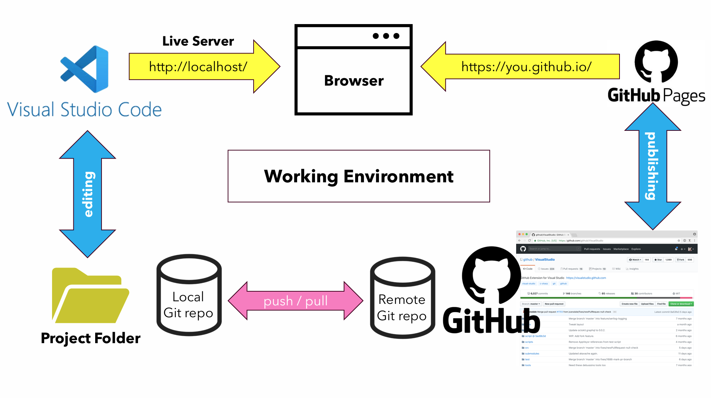

# Lecture 1: Kickoff

During the first lecture, a lot of information is given about the complete program.
These notes however, will focus on the content of the first course: PCO.

## Working Environment Setup

The start of every programming course is setting up the working environment.
This includes installing the necessary software and setting up the development environment.
During this course, a website will be created, so the following software is needed:

- A text editor (e.g. Visual Studio Code)
- A web browser (e.g. Microsoft Edge)
- A version control system (e.g. Git through GitHub)
- A web server (e.g. GitHub Pages)

The people from the ICT recommend using Microsoft Visual Studio Code as the text editor.
However, students are free to use any text editor you like.
Personally, I prefer using Visual Studio Community Edition.
Because it has more features than Visual Studio Code out of the box.