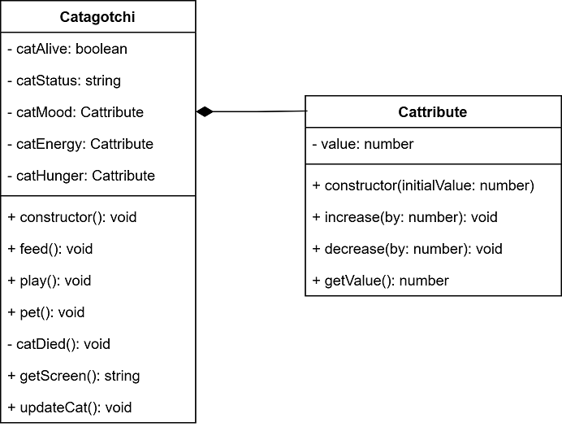

# Object Oriented Programming Notes

Course Code: CU75004V1

## Introduction

Object Oriented Programming (OOP) is a method to translate concepts and things into classes within our code. A class is a template for an object, containing both class variables (properties) and function (methods). Once defined, we can create instances of a class known as objects.

```ts
class NumberDisplay {
    private value: number;
    private limit: number;

    public constructor(limit: number) {
        this.value = 0;
        this.limit = limit;
    }

    public setValue(value: number): void {
        this.value = value;
    }

    public getValue(): number {
        return this.value;
    }

    public increase(): void {
        this.value += this.value + 1 <= this.limit ? 1 : 0;
    }
}
```

Every property and method starts with public or private, these are known as *accessors*. A private fields can only be accessed by code inside the same class, public fields can be accessed anywhere. Also note the special methode know as the constructor; this method initiates the instance of class and is optional. When used, this is where you setup class variables.

When designing classes, one thinks of all the components that are going to be made and writes this down in a class diagram. It has three sections: name, properties and methods. The + indicates public, the - indicates private. For example:



As programmers, we want to write our code as DRY (Don't Repeat Yourself) as possible. Keeping this in mind makes our code shorter and more maintainable. Composition is the name of classes working together to find a common goal.
